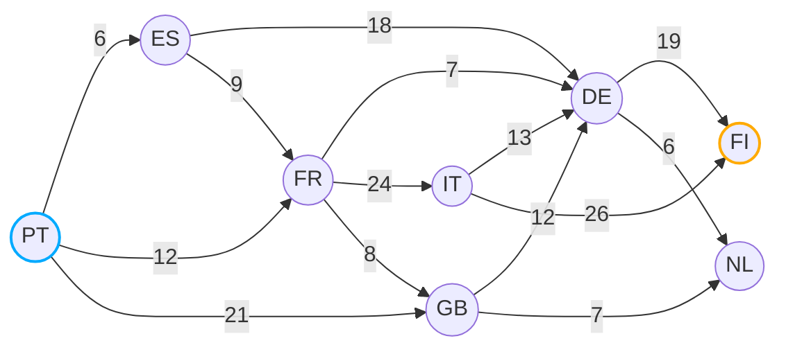

# Algorithms and Data Structures - A-Star (A*)

## Demo

[Find the shortest path between two cities](./src/a-start-graph.py)

**Tabela de heurísticas para chegar ao destino:**

| Origem | Cidade      | `h(n)` |
|--------|-------------|--------|
| PT     | Portugal    | 27     |
| ES     | Espanha     | 19     |
| FR     | França      | 25     |
| GB     | Reino Unido | 10     |
| NL     | Holanda     | 26     |
| DE     | Alemanha    | 19     |
| IT     | Itália      | 23     |
| FI     | Finlândia   | 0      |

## References
- [Other algoritmos & Data Structures](https://github.com/NelsonBN/algorithms-data-structures)
- [Wikipedia](https://en.wikipedia.org/wiki/A*_search_algorithm)
